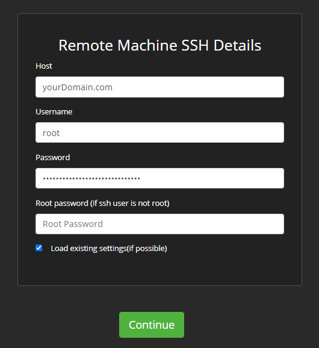
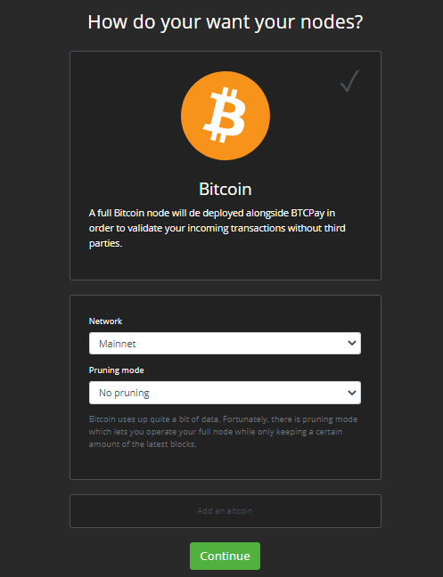
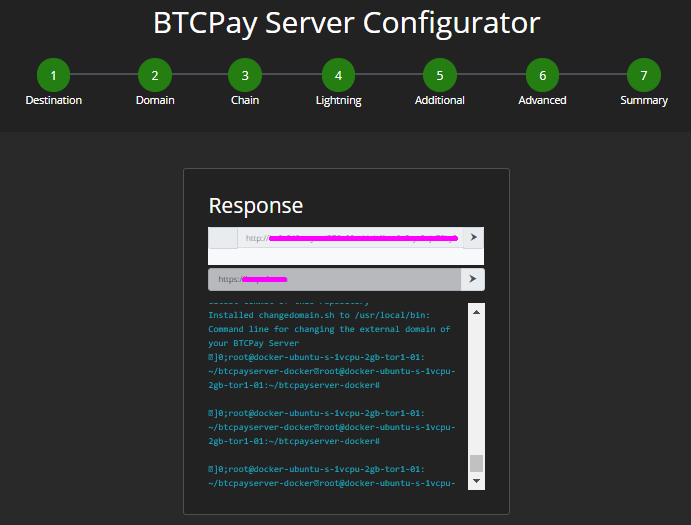

# Deploy BTCPay with Configurator

BTCPay Server can easily be configured and deployed to a server using Configurator. This tool makes deployment simple by allowing users to initialize or modify their BTCPay setup from the Configurator.

Configurator can be used to modify an existing BTCPay Server, from the admin account only. Other users may visit the server's Configurator url to deploy new BTCPay instances. When enabled, Configurator is located at 

Someone such as a BTCPay third-party host may provide a Configurator instance for their users. This can help transition users to a self-hosted solution when they are ready to stop using the third-party host's server.

Another use-case is for server admins who are deploying BTCPay Server's on behalf of clients or other users as part of a consulting business. Admins can easily export a Docker deployment script from Configurator selections or deploy the configuration immediately to a VPS or on-premise server using SSH.

# How to set up Configurator

## Option 1: Add as an external service to BTCPay

If you already have an existing BTCPay Server [deployed](https://docs.btcpayserver.org/Deployment/) with the `opt-add-configurator` [environment variable added](https://docs.btcpayserver.org/FAQ/FAQ-Deployment#how-can-i-modify-or-deactivate-environment-variables), view your Configurator by navigating to: 

**Server Settings > Services > Other external services > Configurator > Click See information**

Once enabled, non-admins may also view the Configurator at: `yourbtcpaydomain.com/configurator`.

## Option 2: Build locally with Docker

If you have Docker installed on your machine, you can open a terminal and the run the following command to run Configurator inside of a Docker container to use on your local machine:

`docker run -p 1337:80 --name btcpayserver-configurator btcpayserver/btcpayserver-configurator`

Now you can open a browser tab and view your Configurator at **localhost:1337**

# How to use Configurator

Step 1: Destination

Select an option to deploy using SSH now or generate a bash script for later deployment.

To configure and deploy a server now, provide your SSH credentials where you would like it deployed to. 

Note: The "Load Existing Settings" option will use the previous deployment's selections for faster configuration if you are modifying an existing installation.

Step 2: Domain

Provide the domain name associated with your server IP address.

Step 3: Chain

Select the desired Bitcoin network type, Bitcoin node pruning level and add any altcoins.

Step 4: Lightning

Select the desired Lightning network option (optional).

Step 5: Additional

Add any additional services to your BTCPay Server deployment (optional).

Step 6: Advanced

Provide any additional advanced settings (optional).

Step 7: Summary

Verify your configuration settings look correct before deploying the server.

During Deployment:

Configurator will SSH into the target server and do the following actions completely automated on your behalf:

- Install Docker
- Install Docker-Compose
- Install Git
- Setup BTCPay settings
- Make sure it starts at reboot via upstart or systemd
- Add BTCPay utilities in /user/bin
- Start BTCPay

The deployment progress will be displayed in your Configurator.

Upon deployment completion, Configurator will display the domain of the newly configured BTCPay Server.

The list of executed commands that were used to deploy the server configuration are also displayed.

## Export Manual Configuration

If you want to deploy the configuration to your server at a later time, you can instead export a bash script of your settings. Later you can paste the configuration into your server terminal. 

## Privacy & Security Concerns

If you are using someone else's Configurator to deploy your BTCPay Server, such as a [trusted Third-Party](https://docs.btcpayserver.org/ThirdPartyHosting/), you will be providing them with your:

- server IP/domain and ssh password
- server configuration settings

Users are advised to change their SSH password after Configurator deployment is complete.

To mitigate these privacy and security concerns, use either the [local deployment with Docker](#option-2-build-locally-with-Docker) or the [exported manual script](#export-manual-configuration) without providing your domain. Be sure to include the domain when you paste the commands into your terminal. 
